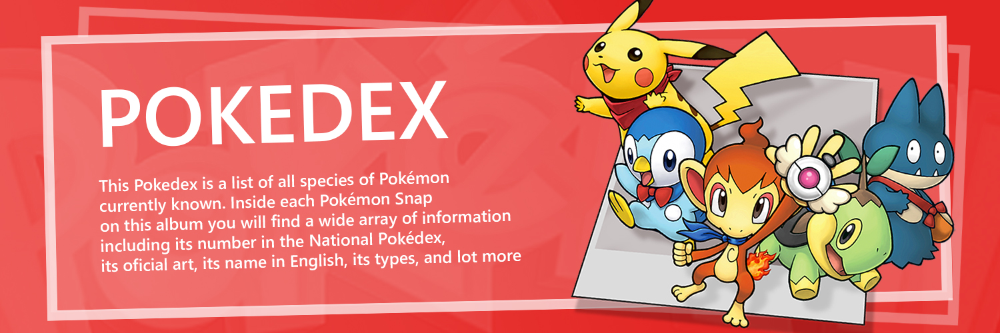

 

This simple project is an exercise of the introductory course to React provided by <a href="https://argentinaprograma.com" target="_blank">"r/Argentina Programa"</a>. The data used for this exercise was provided by <a href="https://pokeapi.co/" target="_blank">PokeAPI.co API</a>. The web design and page layout is based on the design of the PokeAPI.co webpage.

The purpose of the exercise was to encompass all basics concepts approached by the course: functional components, state management through useState and useReducer hooks, routing with react-router, useEffect and API requests, CSS-in-JS through Emotion's Styled Components, among others concepts.

 

<h1>Key Features.</h1>
<ul>
  <li>Navigate through the bast array of Pokémons and find more than 1000+ differents Pokémons provided by PokeAPI.</li>
  <li>Display- Find information from each Pokémon along side its original art.</li>
</ul>

 
<h2>Search.</h2>

The Database contains all the Pokémons provided by PokéAPI, ordered by its current Pokémon Number. Each entry shows the name and art of said Pokémon. Click on the "snap" and gain access to all the data.

 

 
<h2>Display.</h2>

Inside each Pokémon Snap on this album you will find a wide array of information including its number in the National Pokédex, its oficial art, its name, its types, size, weight, stats, and more.

 

 
<h2>Credits</h2>
<ul>
  <li>You can visit <a href="https://argentinaprograma.com" target="_blank">r/Argentina Programa</a> to access the ongoing course for free.</li>
  <li>An alternative and more limited version of this project (built in vanillaJS) can be found <a href="https://github.com/bernardjp/pokedex-vanilla-js" target="_blank">here</a>.</li>
</ul>
